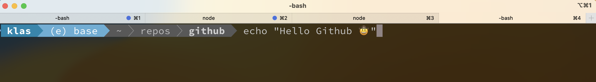

  

   

  

# Hey there, I'm Klas Holmberg! 👋

I'm a software developer who's passionate about turning ideas into reality, exploring new technologies, and all things where creativity thrives. 

Currently, I'm sharpening my skills in GCP and Go. 🚀

## ⚡ Technologies

  &nbsp;
  &nbsp;
  &nbsp;
  &nbsp;
  &nbsp;
  &nbsp;
  &nbsp;
  &nbsp;
  &nbsp;
  &nbsp;
  &nbsp;
  &nbsp;
  &nbsp;
  &nbsp;
  &nbsp;
  &nbsp;
  &nbsp;
  &nbsp;
  &nbsp;
  &nbsp;
  &nbsp;
  
  
  

Talk to me about:

- Backend development using **Node, Express, Flask, FastApi**
- Front-end development using **React, Polaris**
- Robust full-stack system design implementation
- Creating scalable cloud architecture using **AWS Cloud, GCP**
- Solving Data structure and algorithm questions in **Python, C++, JavaScript**
- Small scale electronics/robotics projects
  
Or if you have any magic programmer jokes, such as:

## 📫 Get in touch
Send me an 📧 at klas.holmberg@netlight.com.

----

⭐️ From [@goldh0rse](https://github.com/goldh0rse)
